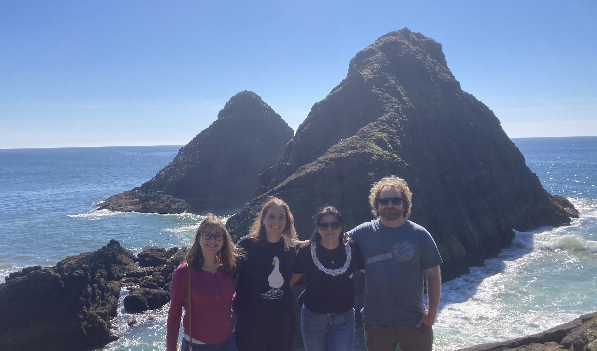
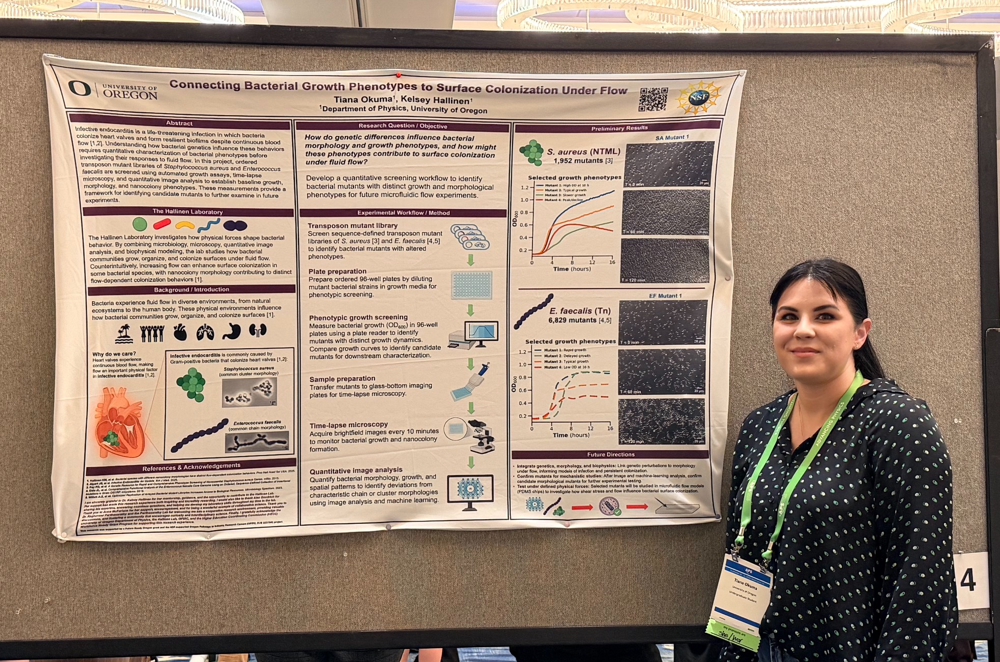

As experimental biophysicists, our lab works at the interface between bacterial communities and the physical, complex environments they find themselves a part of. 

In particular, we are interested in the impact of fluid flow. Bacteria experience flows in a variety of settings- in the natural environment of forests, deserts, and oceans, as part of our microbiome, or as they make us sick. Features of these fluid flows can vary drastically from environment to environment and how bacteria navigate, survive, and ultimately thrive in these flows drives our work, focusing on the bacteria that make us sick.

Our lab is based in the Physics department at the University of Oregon and we are part of UO’s Materials Science Institute and the Institute of Molecular Biology 

  
  

